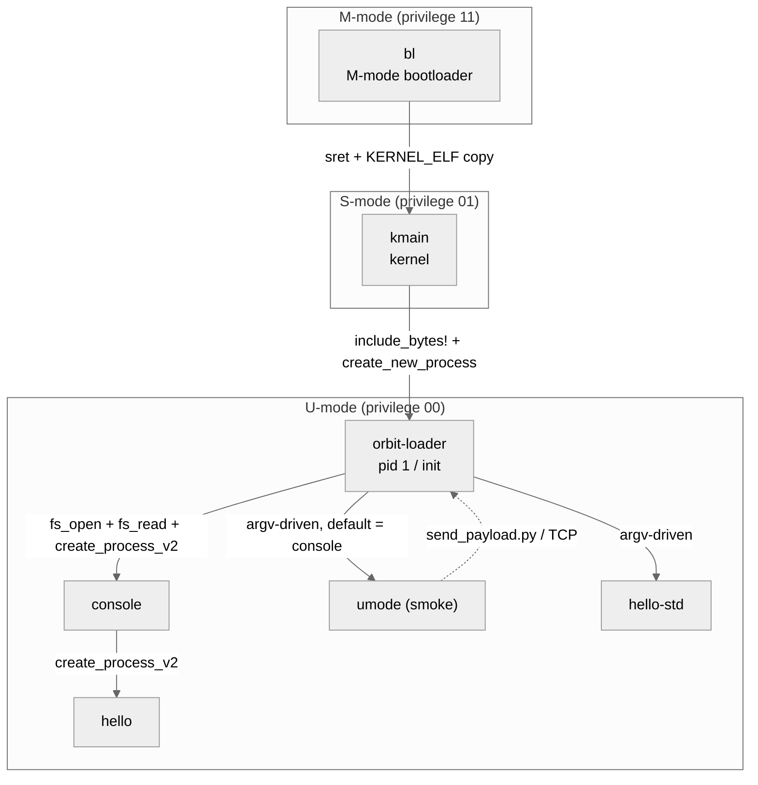
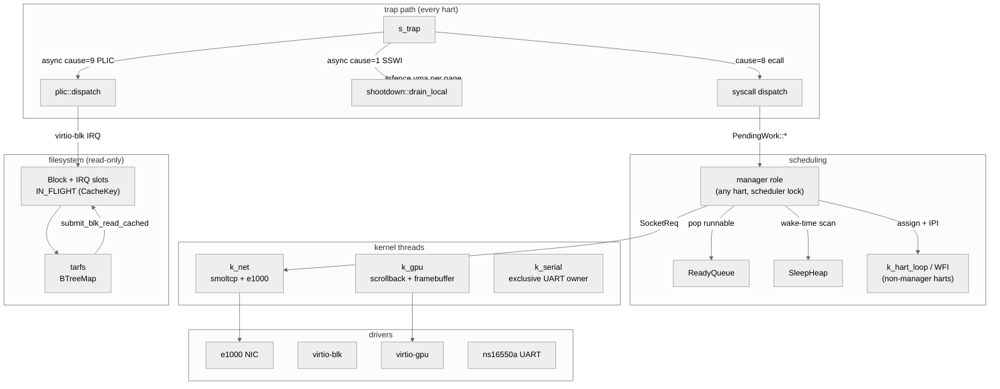
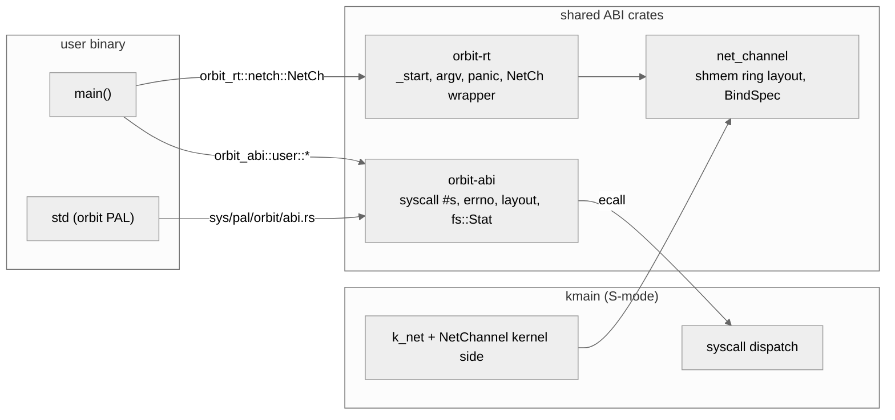

# Orbit architecture

Top-level map of the system — privilege tiers, the major kernel-side
components, and the ABI seams that connect user processes to them.

Each node in the diagrams below links to its load-bearing source file.
Detailed contracts live as docstrings on the linked types/functions;
this doc orients you to the shape of the system before you start
reading code.

## Privilege tiers

**bl → kmain** is the only privilege transition that has no FS in
front of it: bl embeds the kernel ELF via `include_bytes!`, copies
its `PT_LOAD` segments into RAM, and `sret`s into S-mode. The full
boot sequence is in [docs/boot.md](boot.md).

**kmain → orbit-loader** is the second hard-coded link: kmain embeds
the loader ELF (also `include_bytes!`) and creates pid 1 from it in
[`k_smpstart`](../kmain/src/bin/orbit.rs). Boot argv (`argv[1]`)
selects which init the loader will spawn; cfg features
(`smoke` / `hello-std`) only change the argv, not the embedded ELF.

**orbit-loader → init child** is the first link that goes through
tarfs. The loader `fs_open`s the path it received as argv[1],
chunked-`fs_read`s it into a heap buffer, and `create_process_v2`es
the result. After init spawns, the loader stays alive listening on
TCP :7777 for ad-hoc payloads delivered via
[`send_payload.py`](../orbit-loader/tools/send_payload.py).

## Kernel-side subsystems

**Manager role vs idle harts.** The "manager" isn't a fixed hart —
it's a role any hart picks up by taking the scheduler lock
(`SchedGuard::try_with`, [process/src/sched_lock.rs](../process/src/sched_lock.rs)).
Whichever hart wins the swap drains the `PendingWork` ring, scans the
sleep heap, and makes cross-hart schedule decisions; the rest spin in
`k_hart_loop`'s WFI waiting on SSWI from the ACLINT
([memmap](../kmain/src/kernel/memmap.rs)). When the manager assigns
work, recipients pick it off `ReadyQueue` and context-switch into
the user thread. Hart 0 is just first to *try* the lock during
boot bring-up — any hart can hold it during steady state, and the
role hands off whenever the current holder yields back to its own
user/idle work.

**Kernel threads** are S-mode threads with their own stack and
trap frame, scheduled identically to user threads except for the
mode bit. `k_net` is the canonical example
([kmain/src/lib.rs](../kmain/src/lib.rs)) — it owns the smoltcp
`Interface`, drives the e1000 ring buffers, and steps each
NetChannel-owned socket. Conventions for writing new ones land in
[docs/kernel-threads.md](kernel-threads.md).

**Async block I/O.** `submit_blk_read_cached`
([`kmain/src/drivers/virtio_blk_dev.rs`](../kmain/src/drivers/virtio_blk_dev.rs))
predicts the next descriptor head, records the page-cache key in
`IN_FLIGHT[head]` *before* the device-side notify, then submits. The
PLIC IRQ handler drains the used ring and forwards each completion to
the manager as `PendingWork::CacheFill`, which fills the page-cache
slot and resumes whatever was waiting on it.

**TLB shootdown.** Any path that mutates a user PTE
(`mmap`, `munmap`-shaped revokes, `install_argv_blob`) calls
[`shootdown::broadcast`](../kmain/src/kernel/shootdown.rs); receivers
drain their per-hart ring in the SSWI cause-1 arm and `sfence.vma`
the requested ranges. Boot-window guard:
`mark_secondaries_kicked` flips the gate after hart 0 wakes the
secondaries, so an early-boot broadcast doesn't wait forever.

## ABI seams

The three ABI crates are the only Rust types that span the user/kernel
boundary, so their layouts are load-bearing:

- **[orbit-abi/](../orbit-abi/)** — syscall numbers, errno table, VA
  layout constants, `Stat` / `DirEntry` shapes. Kernel-side handlers
  match on these directly; bumping a constant is an ABI break. Tests
  in [`orbit-abi/src/syscall.rs`](../orbit-abi/src/syscall.rs) pin
  the wire numbers and ordinals.
- **[net_channel/](../net_channel/)** — shared-memory ring layout
  used for TCP/UDP sockets. Field offsets are part of the contract
  because user-space and `k_net` both poke the rings.
  [`channel_state`](../net_channel/src/lib.rs) constants
  (`IDLE` / `IN_FLIGHT` / `ACTIVE` / `CLOSING` / `FAILED`) are the
  state-machine sentinels.
- **[orbit-rt/](../orbit-rt/)** — user-side runtime. Provides
  `_start` ([orbit-rt/src/start.rs](../orbit-rt/src/start.rs)), argv
  resolver ([orbit-rt/src/argv.rs](../orbit-rt/src/argv.rs)),
  `dlmalloc`-backed global allocator for `no_std` binaries, and a
  `NetCh` wrapper that owns the shared ring lifecycle.

## Memory layout

Sv48 with the kernel in the high half and user space in the low half.
Constants live in [orbit-abi/src/layout.rs](../orbit-abi/src/layout.rs)
(user side) and [kmain/src/kernel/memmap.rs](../kmain/src/kernel/memmap.rs)
(kernel side); the docstrings on each constant carry the contract.

| Region | VA | Owner | Notes |
|---|---|---|---|
| `KTEXT_BASE` | `0xFFFF_FFC0_0000_0000` | kmain | PIE-relocated kernel image |
| `KDMAP_BASE` | `0xFFFF_FFD0_0000_0000` | kmain | linear map of all RAM |
| `KMMIO_BASE` | `0xFFFF_FFE0_0000_0000` | kmain | UART / CLINT / ACLINT aliases |
| `USER_TEXT_BASE` | `0x2_2000_0000` | user | ELF image |
| `UPROC_STACK_BASE` | `0x1000_0000` | user | per-thread stack slots (32 MiB stride, 256 slots) |
| `UPROC_PRIV_BASE` | `0x3_0000_0000` | user | private heap + private mmap |
| `UPROC_SHARED_BASE` | `0x4000_0000_0000` | user | shared mmap + NetChannels |
| `USER_TRAP_FRAME_BASE` | `0x7E00_0000_0000` | kernel-private | per-thread TrapFrame (no U bit) |

## Process model

```mermaid
%%{init: {'theme': 'neutral'}}%%
graph LR
    subgraph PROC["Process (kmain)"]
        SATP["satp / page table"]
        MAPS["UserMappings"]
        HANDLES["ProcessHandles<br/>NetChannel/File/Stdin/Stdout/Stderr/EventFd"]
        ARGV["argv blob<br/>USER_ARGV_BASE"]
        THREADS["Threads + thread_slots"]
    end

    subgraph THREAD["Thread"]
        TF["TrapFrame"]
        STATE["ThreadState"]
        SCHED_HOOK["wake_time / handle / block_reason"]
    end

    PROC --> THREAD

    click PROC "../process/src/lib.rs" "Process struct"
    click THREAD "../process/src/lib.rs" "Thread struct"
    click HANDLES "../kmain/src/kernel/handle.rs" "Handle::{NetChannel, File, Stdin, Stdout, Stderr, EventFd}"
    click ARGV "../kmain/src/kernel/mod.rs" "install_argv_blob"
```

A `Process` ([process/src/lib.rs](../process/src/lib.rs)) owns its
page table, the kernel-side mappings, the per-process handle table
(NetChannels, open files, std streams, eventfds), and 256 thread
slots. Each `Thread` carries its own TrapFrame, ThreadState, and the
per-thread slots the manager writes results into when a blocking
syscall completes.

Blocking syscalls park the thread and queue a tid-carrying
`PendingWork` entry; whichever hart next holds the scheduler lock
drains the ring, runs the kernel-side action, and resumes the parked
thread via `publish_pending_for_tid`. The lifecycle contract is
documented on [`PendingWork`](../orbit-core/src/pending_work.rs).

## File / struct map (top-level)

| Component | Source |
|---|---|
| M-mode bootloader | [bl/src/lib.rs](../bl/src/lib.rs) |
| Kernel binary | [kmain/src/bin/orbit.rs](../kmain/src/bin/orbit.rs) |
| Trap frame / hart context | [device/src/lib.rs](../device/src/lib.rs) |
| Page tables | [mmu/src/](../mmu/src/) |
| Frame allocator | [mem/src/](../mem/src/) |
| Process / thread | [process/src/lib.rs](../process/src/lib.rs) |
| Pure scheduler logic | [orbit-core/src/](../orbit-core/src/) |
| Syscall handlers | [orbit-core/src/syscall.rs](../orbit-core/src/syscall.rs) |
| TLB shootdown | [kmain/src/kernel/shootdown.rs](../kmain/src/kernel/shootdown.rs) |
| Block device | [virtio_blk/](../virtio_blk/), [kmain/src/drivers/virtio_blk_dev.rs](../kmain/src/drivers/virtio_blk_dev.rs) |
| Tarfs | [kmain/src/kernel/fs/tar.rs](../kmain/src/kernel/fs/tar.rs) |
| e1000 + smoltcp | [kmain/src/drivers/e1000.rs](../kmain/src/drivers/e1000.rs), [kmain/src/lib.rs `k_net`](../kmain/src/lib.rs) |
| GPU + display | [kmain/src/drivers/k_gpu.rs](../kmain/src/drivers/k_gpu.rs), [kmain/src/drivers/display.rs](../kmain/src/drivers/display.rs) |
| Serial | [serial/src/lib.rs](../serial/src/lib.rs) |
| Per-process handle table | [kmain/src/kernel/handle.rs](../kmain/src/kernel/handle.rs) |
| Shared user pointer (revocable) | [kmain/src/kernel/shared_user_ptr.rs](../kmain/src/kernel/shared_user_ptr.rs) |
| User-side runtime | [orbit-rt/src/](../orbit-rt/src/) |
| User ABI | [orbit-abi/src/](../orbit-abi/src/) |
| NetChannel layout | [net_channel/src/lib.rs](../net_channel/src/lib.rs) |
| std PAL (orbit) | [rust/library/std/src/sys/pal/orbit/](../rust/library/std/src/sys/pal/orbit/), [rust/library/std/src/sys/fs/orbit.rs](../rust/library/std/src/sys/fs/orbit.rs) |

## Read more

- [docs/boot.md](boot.md) — bl → kmain → orbit-loader → init
- [docs/kernel-threads.md](kernel-threads.md) — conventions for
  writing new kernel threads (k_net-style)
- [CLAUDE.md](../CLAUDE.md) — build / run / debug procedures
