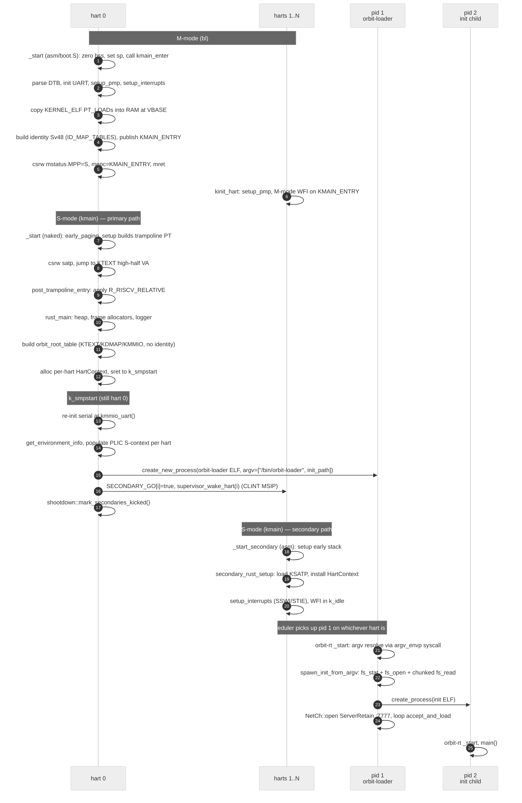

# Orbit boot

End-to-end sequence from `qemu-system-riscv64 -kernel launch` to the
first user process running its init payload off tarfs. Read
[architecture.md](architecture.md) first for the static picture; this
doc traces the dynamic one.

The path crosses three privilege levels and four artifacts:

```
QEMU → bl (M)   → kmain (S)   → orbit-loader (U, pid 1)   → init child (U, pid 2)
       launch     orbit         orbit-loader                /bin/{console,smoke,hello-std}
```

## Sequence



The sequence omits a few details for clarity (per-hart trap-frame
allocation, CLINT MSIP write coalescing, `KDMAP_BIAS` publish) — see
the source files cited under each stage for the full story.

## Stages

### 1. M-mode (bl)

[bl/](../bl/) is the `launch` binary fed to QEMU's `-kernel`. Linked
at PA `0x80000000` ([bl/memory.x](../bl/memory.x)).

- **Asm entry** [bl/asm/boot.S](../bl/asm/boot.S): zero `.bss`, set
  per-hart sp from `KERNEL_STACK_END`, hart 0 calls `kmain_enter`,
  others call `kinit_hart`.
- **`kmain_enter`** [bl/src/lib.rs](../bl/src/lib.rs): UART init from
  the DTB, `setup_pmp` (TOR regions for bl text vs rodata vs the rest),
  `setup_interrupts` (M-mode mtvec → `m_trap_vector`), parse the
  embedded kernel ELF (`KERNEL_ELF` from
  [bl/src/lib.rs](../bl/src/lib.rs)), copy `PT_LOAD` segments into
  RAM at `VBASE = 0x80000000 + 64 MiB`, build identity Sv48 at
  `ID_MAP_TABLES` (`0x80800000 - 2 MiB`), publish
  `KMAIN_ENTRY = entrypoint`, `mret` into S-mode kmain.
- **`kinit_hart`** (secondaries): same `setup_pmp`, then M-mode WFI
  spinning on `KMAIN_ENTRY`. Hart 0's MSIP wake unblocks them once
  kmain has published its `KSATP` (and the `KDMAP_BIAS` over an
  M-mode `ecall(4)`).
- **Trap frames** for all harts live at `0x80800000` so the M-mode
  trap handler can route interrupts before paging is on.
  `m_trap_vector` switches `sp` to bl's own `KERNEL_STACK_END`
  before calling Rust so spills don't end up on the kernel's KDMAP
  stack (which M-mode would dereference bare).

### 2. S-mode trampoline (kmain `_start`)

[kmain/src/bin/orbit.rs](../kmain/src/bin/orbit.rs).

- **`_start` (naked)**: hart 0 runs `early_paging_setup` to build a
  temporary Sv48 table — identity for RAM/MMIO plus
  `KTEXT_NOMINAL → load_addr` and `KDMAP_NOMINAL → RAM` direct-map.
  `csrw satp`, then jump into the high-half VA so subsequent
  instructions execute under the kernel mapping.
- **`post_trampoline_entry`**: applies `R_RISCV_RELATIVE` with
  `slide = ktext_base - LINK_BASE` *before* any Rust code touches a
  relocated global. Tail-calls `rust_main`.

### 3. `rust_main` — kernel state setup

Hart 0 only.

- Initialize the linked-list heap (`KHEAP` at its KDMAP VA).
- Frame allocators: `ktables` (page tables, kernel-only) and
  `kpages` (general-purpose kernel pages). Both return KDMAP VAs
  via `add_frame_with_va_base`.
- Install `OrbitLogger` / `OrbitSubscriber`.
- Build the final Sv48 table via `map_kernel_self` (KTEXT / KDMAP
  / KMMIO regions, no identity left).
- Allocate per-hart `HartContext` structs at known offsets.
- `sret` into `k_smpstart` running on the kernel's own satp.

Layout constants and `RootTable` helpers:
[kmain/src/kernel/memmap.rs](../kmain/src/kernel/memmap.rs).

### 4. `k_smpstart` — boot the user/SMP world

Still hart 0.

- Re-`init_serial` at `kmmio_uart()` so prints land via the high-half
  MMIO alias.
- `orbit.get_environment_info()` populates DTB-derived state.
- Walk PLIC S-contexts and stamp each `HartContext.plic_s_context`.
- **Build boot argv**: pack `["/bin/orbit-loader", init_path]` via
  [`orbit_abi::argv::pack`](../orbit-abi/src/argv.rs). `init_path`
  is cfg-selected:
  - default → `/bin/console`
  - `feature = "smoke"` → `/bin/smoke`
  - `feature = "hello-std"` → `/bin/hello-std`
- **Spawn pid 1** via `orbit.create_new_process` from the embedded
  orbit-loader ELF (`UMODE_TEST_ELF`); `install_argv_blob` maps the
  argv page at `USER_ARGV_BASE` in pid 1's address space.
- **Kick secondaries**: `SECONDARY_GO[i].store(true)` Release; then
  `supervisor_wake_hart(i)` writes the ACLINT SSWI MSIP for each.
- **Flip the shootdown gate**:
  [`shootdown::mark_secondaries_kicked()`](../kmain/src/kernel/shootdown.rs).
  Before this call any `broadcast` is a no-op (secondaries can't
  drain their rings yet); after it, the broadcast actually waits
  for acks. `install_argv_blob` above ran *before* the flip, which
  is why it's safe — there are no remote TLBs to invalidate yet.

### 5. Secondary harts

[`_start_secondary` and `secondary_rust_setup`](../kmain/src/bin/orbit.rs).

- Asm entry sets the early stack, then jumps to
  `secondary_rust_setup(hartid)`.
- `secondary_rust_setup` Acquire-loads `KSATP`, `HART_CTX_PA`, and
  `KDMAP_BIAS_BOOT` (publishes from `rust_main`), installs its
  `HartContext`, calls `setup_interrupts` (SSWI + STIE), then
  drops into `k_idle`/WFI.
- A scheduler decision on the manager hart wakes a secondary via
  SSWI; the secondary takes the trap, drains its shootdown ring,
  pops a runnable thread off `ReadyQueue`, and context-switches
  into it.

### 6. orbit-loader runtime (pid 1)

[orbit-loader/src/main.rs](../orbit-loader/src/main.rs). Linked at
`USER_TEXT_BASE = 0x2_2000_0000`.

- **orbit-rt `_start`** [orbit-rt/src/start.rs](../orbit-rt/src/start.rs)
  eagerly resolves argv (one `argv_envp` ecall, cached) and calls
  `main`.
- **`spawn_init_from_argv`** reads `argv[1]` (the init path):
  - `fs_stat(path)` → size; reject if 0 or > `MAX_INIT_ELF_BYTES` (4 MiB).
  - `fs_open(path)` → fd.
  - Chunked `fs_read(fd, &mut sector)` (sector-aligned) into a heap
    `Vec<u8>` until size bytes accumulated.
  - `create_process(elf_ptr, elf_len, 0, 0)` → pid 2.
  - All failure paths log and fall through (loader still hosts the
    TCP listener; an unmounted FS or mistyped path doesn't strand
    the boot).
- **TCP listener**: `NetCh::open(ServerRetain :7777)`, loop
  `accept_and_load` forever. Used for ad-hoc binary delivery via
  [send-payload.py](../orbit-loader/tools/send-payload.py).

### 7. Init child (pid 2)

Whatever `init_path` pointed at — `console` for the default build,
`smoke` (umode) for the smoke harness, `hello-std` for the std
canary. Goes through orbit-rt's `_start` like any user binary.
The only kernel-side argv blob installed is on the loader (pid 1);
the init child is created with no argv today — convention may grow
("init's argv shapes the child") if a real shell needs it.

## Hand-off table

| Stage | Hart | Privilege | Code path |
|---|---|---|---|
| Reset | 0..N | M | [bl/asm/boot.S](../bl/asm/boot.S) |
| Hart 0 M-init | 0 | M | [`kmain_enter`](../bl/src/lib.rs) |
| Secondaries M-park | 1..N | M | [`kinit_hart`](../bl/src/lib.rs) |
| `mret` to S | 0 | M→S | [bl/src/lib.rs](../bl/src/lib.rs) |
| Trampoline | 0 | S | [`_start`, `post_trampoline_entry`](../kmain/src/bin/orbit.rs) |
| Kernel state setup | 0 | S | [`rust_main`](../kmain/src/bin/orbit.rs) |
| First user spawn | 0 | S | [`k_smpstart`](../kmain/src/bin/orbit.rs) |
| Secondary M-wake | 1..N | M→S | bl `kinit_hart` MSIP path → kmain `_start_secondary` |
| Secondary kernel setup | 1..N | S | [`secondary_rust_setup`](../kmain/src/bin/orbit.rs) |
| Idle / scheduler | 1..N | S | `k_idle` / scheduler dispatch |
| `sret` to U | any | S→U | trap return after `create_new_process` |
| pid 1 main | any | U | [`orbit-loader main`](../orbit-loader/src/main.rs) |
| pid 2 main | any | U | console / smoke / hello-std |

## Boot-window invariants

A handful of things are only safe at specific points in the sequence;
violating them is the source of most boot-bringup bugs.

- **`shootdown::broadcast` is a no-op until `mark_secondaries_kicked`.**
  Hart 0 calls the mark *after* `SECONDARY_GO` + the IPI kicks. Any
  PT mutation before that is broadcast-free; safe because no other
  hart has observed user mappings yet. Calling broadcast pre-mark
  would `wait_zero_spin` against harts still spinning in
  `secondary_rust_setup` — instant deadlock.
- **`MANAGER_LOCK` is uncontended on hart 0** during stages 3–4.
  No syscall-driven `PendingWork` exists yet; hart 0 holds the
  lock implicitly. Once secondaries come online and the scheduler
  starts dispatching threads, the lock becomes a proper contention
  point and the manager role floats per
  [architecture.md](architecture.md).
- **Serial init order matters.** `init_serial` runs twice on hart 0
  — once in bl (raw PA), once in `k_smpstart` after the kernel
  satp's KMMIO alias is live. Anything between the two prints
  through bl's mapping; anything after uses `kmmio_uart()`.
- **`KDMAP_BIAS` must publish before the first `kinit_hart` MSIP**.
  Secondaries dereference KDMAP VAs (their `sscratch` and `sp`)
  before they `csrw satp` to the kernel's table; the bias is the
  arithmetic that makes those dereferences work in M-mode.
  Published over `ecall(4)` from kmain to bl.
- **`SECONDARY_GO[i]` Release publishes the kernel state.** Secondary
  harts Acquire-load it and observe `KSATP` / `HART_CTX_PA` /
  `KDMAP_BIAS_BOOT` published in `rust_main`. Reordering the
  Release would race them onto a half-built kernel.

## Triggering boot

Build then run from the repo root:

```bash
./build-all.sh                     # default — argv[1]=/bin/console
./build-all.sh --features smoke    # argv[1]=/bin/smoke (umode)
./build-all.sh --features hello-std
./smoke                            # full automated end-to-end test
```

Per-layer details: [CLAUDE.md](../CLAUDE.md).
