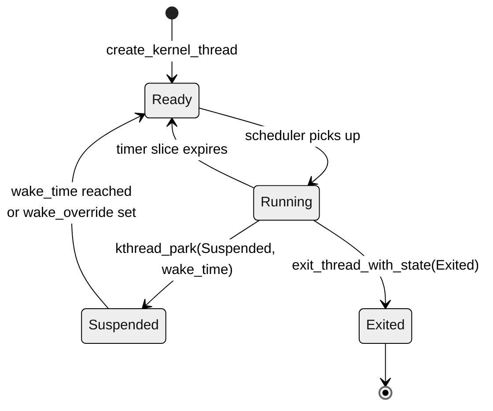

# Kernel threads

Conventions for writing S-mode kernel threads (kthreads) — long-lived
work loops that own a kernel-side resource and serve user processes
through shared rings or syscall round-trips. Read
[architecture.md](architecture.md) for the static picture and
[boot.md](boot.md) for where the existing kthreads (`k_net`, `k_gpu`,
`k_serial`) get spawned.

A kthread is an S-mode `Thread` with `pid = 0`, scheduled identically
to a user thread except for the mode bit. It runs on whichever hart
the scheduler dispatches it to; it must not assume a particular hart.

## Lifecycle



The transitions match user threads exactly — kthreads use the same
[`ReadyQueue`](../orbit-core/src/ready_queue.rs) /
[`SleepHeap`](../orbit-core/src/sleep_heap.rs) /
[`ThreadState`](../process/src/lib.rs) machinery. The asymmetries:

- **Yield path is different.** User threads yield via syscalls
  (the `s_trap` `cause = 8` arm). Kthreads yield via
  [`kthread_park`](../kmain/src/kernel/context.rs), which stages its
  park state and then issues an S-mode `ecall` (`cause = 9`, tagged
  with `KPARK_ECALL_NR` in `a7`) so it goes through the canonical
  trap-save path before handing off to `k_hart_loop`. Calling the
  user syscall path from a kthread panics; calling `kthread_park`
  from a user thread is also a panic (asserted in the function).
- **Stack is kernel-allocated.** Each kthread gets a 2 MiB stack from
  `kernel_pages` ([Orbit::THREAD_STACK_LAYOUT](../kmain/src/kernel/mod.rs)).
  No TLS, no per-thread user-VA region.
- **`satp` is the kernel's**, not a per-process root. Kthreads
  observe the same address space hart 0 set up in `rust_main`;
  user PT walks happen via the manager-side helpers (`memmap::user_va_to_kdmap`
  in [kmain/src/kernel/memmap.rs](../kmain/src/kernel/memmap.rs)).

## Spawning

[`Orbit::create_kernel_thread`](../kmain/src/kernel/mod.rs):

```rust
pub fn create_kernel_thread(
    &mut self,
    entrypoint: usize,    // PC the kthread starts at; cast `extern "C" fn` ptr
    a0: Option<usize>,    // value placed in regs[10] at entry; None → 0
) -> Result<u32, ()>
```

- Allocates a 2 MiB stack (`kernel_pages.alloc`) and a TrapFrame page
  (`allocate_trap_frame`).
- Builds a `Thread { mode: Supervisor, pid: 0, satp: self.satp, ...
  state: Ready }`.
- Inserts into `self.threads` and `self.ready` so the next scheduler
  scan picks it up.
- Returns the kernel-allocated `tid`.

**Caller context.** Must be called with `&mut Orbit` in hand — i.e.,
under the scheduler lock or during boot bringup. The three existing
call sites all live in [kmain/src/kernel/mod.rs](../kmain/src/kernel/mod.rs):
`setup_serial_kthread` spawns `k_serial` (the exclusive UART owner)
from `get_environment_info`, the e1000/PCI-NIC setup spawns `k_net`
once the smoltcp `Interface` is built, and the virtio-gpu setup
spawns `k_gpu` once the framebuffer is ready. All run from `setup_*`
paths hart 0 calls during `rust_main`/`k_smpstart`, so the lock is
uncontended.

**Latching the tid.** When a kthread serves user requests, the
producer side (e.g. a syscall that wants to wake the kthread) needs
to know its tid. Stash it on `Orbit` after the create — see
`net_thread_tid` for the pattern.

## Entry-point contract

```rust
#[unsafe(no_mangle)]
pub extern "C" fn my_kthread(a0: usize) {
    // Pre-flight: async traps off until we're inside the loop.
    unsafe { riscv::register::sstatus::clear_sie(); }

    // Pull state out of the package the spawn site published.
    let pkg: &mut MyPkg = unsafe { (a0 as *mut MyPkg).as_mut_unchecked() };

    info!("my_kthread: ready");

    loop {
        // Async traps off again at the top of every loop iteration —
        // we restore sret from kthread_park with sstatus.SIE set, and
        // we don't want a SSWI/timer landing mid-loop.
        unsafe { riscv::register::sstatus::clear_sie(); }

        // … drain rings, do work …

        // Park until next scheduled wake or producer-set override.
        let wake_at = riscv::register::time::read64()
            .wrapping_add(500_000) as usize; // ~50 ms at 10 MHz
        crate::kernel::context::kthread_park(ThreadState::Suspended, wake_at);
    }
}
```

Conventions:

- **Signature is `extern "C" fn(usize)`.** Cast to `*const ()` and
  pass through `create_kernel_thread`'s `entrypoint`. The single
  `usize` argument is whatever `a0` you passed; convention is "raw
  pointer to a state package the spawn site populated."
- **Don't return.** A returning `extern "C" fn` would unwind a
  garbage frame. End the lifecycle with
  `exit_thread_with_state(ThreadState::Exited)` for fatal errors;
  loop forever on the happy path.
- **`#[unsafe(no_mangle)]`** so the symbol is stable for the
  cast-from-fn-pointer to land at the right PC after the
  cross-translation-unit dispatch.

## Communicating with the rest of the system

Three patterns, picked by the data-flow shape:

### 1. Pre-published state package

The spawn site builds a struct holding everything the kthread needs
and passes a pointer through `a0`. The kthread calls `as_mut_unchecked`
once and treats the pointer as `'static` for its lifetime. Used by
both `k_net` ([NetPackage](../kmain/src/kernel/mod.rs)) and `k_gpu`
([GpuPackage](../kmain/src/drivers/k_gpu.rs) — installed via
`install_package`, then read via `package()`).

Use this for state that's set up once and read repeatedly: the
smoltcp `Interface`, framebuffer, ring storage. Layout invariants:

- The struct must outlive the kthread. Boxing into a leaked `Box`
  (or storing in an `Orbit` field with a stable address) is fine;
  putting it on a stack frame that the spawn site returns from is
  not.
- The struct's interior is whatever the kthread's loop needs. Use
  `Option<T>::take()` for one-shot moves (the `phy.take()` pattern
  in `k_net`) so subsequent iterations can't observe partial state.

### 2. SPSC / MPSC ring (thingbuf)

A `static StaticThingBuf<Cmd, N>` lets producers (any hart) push
work onto a fixed-capacity ring without `&mut Orbit`. The kthread
drains the ring at the top of each loop iteration. Used by `k_gpu`
([CONSOLE_RING](../kmain/src/drivers/k_gpu.rs) carries
`Cmd { kind, source, len, bytes, present }`).

Producers push via a non-blocking `push_ref()`; ring-full returns
`Err` and the producer logs-and-drops (or backs off). Consumers
drain via `while let Some(slot) = ring.pop_ref() { … }`.

Use this for stream-shaped traffic where producers are many and
the kthread is the single consumer. Don't use it for request/reply
— there's no per-message handle the producer can wait on.

### 3. PendingWork round-trip

A blocking syscall parks its thread and pushes a tid-carrying
`PendingWork` variant ([orbit-core/src/pending_work.rs](../orbit-core/src/pending_work.rs))
onto `MANAGER_WORK`. Whichever hart holds the scheduler lock runs the
matching arm and resumes the parked thread via
`publish_pending_for_tid` (writes the result a-regs, then pushes
`WakeEvent::Tid`). No `CompletionHandle` is carried in the work item.

A kthread can be the *worker* on this path. `k_net` is the canonical
example: `nc_create` is resolved on the manager side
(`run_nc_create_req` allocates + maps the ring and resumes the
caller); `k_net` itself receives a handle-free `SocketReq` on the
`socket_reqs` ring and only builds and pumps the smoltcp socket from
there on.

Use this whenever a request needs a return value, especially when
the request can fail or carry an out-band result (e.g. an allocated
fd).

## Wake-up patterns

A kthread parked in `kthread_park(Suspended, wake_at)` resumes when:

1. **`wake_at` is reached** — the manager's
   [`SleepHeap`](../orbit-core/src/sleep_heap.rs) scan promotes it
   to Ready.
2. **`wake_override` is set** — any producer can `fetch_or` bits into
   `Thread::wake_override`; the next scheduler scan observes the
   non-zero value and dispatches early. This is how an IRQ handler
   tickles `k_net` before its ~100 ms park elapses.
3. **Both** — earliest of the two wins.

The producer-side helper for case 2 is `WakeEvent`
([manager/src/lib.rs](../manager/src/lib.rs), re-exported through
`crate::kernel`): push a `WakeEvent::Net` (or your own variant) onto
`WAKE_QUEUE` and the manager turns it into the right `wake_override`
bit on the right tid. For known-tid wakes, `WakeEvent::Tid(tid)`
skips the lookup.

`kthread_park` only accepts `Suspended` — a `Blocking` park panics
(the wake-hook protocol that backs `Blocking` only makes sense for
user threads). A kthread that wants to sleep until a producer pokes
it parks `Suspended` with a far-future (or heartbeat) deadline and
relies on `wake_override`.

## Critical-section rules

These are the bits that take the system out, ordered roughly by how
likely they are to bite you.

- **Never hold a spinlock across `kthread_park`.** The park hands
  off to `k_hart_loop` and another hart will dispatch the kthread
  before we ever release; meanwhile any code waiting on the same
  lock deadlocks. Drop locks before park; reacquire after resume.
- **The scheduler lock is held by the manager hart, not by the
  kthread.** A kthread that needs `&mut Orbit` (e.g. to spawn another
  kthread, edit the process table, build a syscall reply) enqueues
  the work via the appropriate manager-side mechanism (`PendingWork`,
  `socket_associations`, or a dedicated MPSC). Do *not* try to take
  the scheduler lock directly from a kthread — the loop holds no
  `&mut Orbit` and there's no machinery to give it one.
- **Clear `sstatus.SIE` before reading hart-local state across a
  potential trap point.** A timer or SSWI mid-read can yield the
  kthread to a different hart on resume; per-hart aliases captured
  before the trap are stale.
- **`set_sum()` only when needed.** `k_net` enables SUM
  (Supervisor User Memory access) so smoltcp can dereference user
  pointers in NetChannel rings. Outside that narrow window keep
  SUM off; a stray user-pointer load with SUM on would silently
  succeed when it should fault.

## Termination

```rust
unsafe { exit_thread_with_state(ThreadState::Exited) };
```

[`exit_thread_with_state`](../kmain/src/kernel/context.rs) marks
the thread Exited and jumps to `k_hart_loop` without returning.
The thread's stack and TrapFrame stay allocated until the manager
reaps Exited threads — same lifecycle as user threads. Kthreads
have no parent waiting on `wait_pid`, so the reap is purely a
cleanup step.

A kthread that exits on a fatal error should `error!(…)` before
calling `exit_thread_with_state` so the cause is in the log.

## Existing kthreads

| Thread | Source | Owns | Lifecycle |
|---|---|---|---|
| `k_net` | [kmain/src/lib.rs](../kmain/src/lib.rs) | smoltcp `Interface`, e1000 phy, NetChannel-backed sockets, DHCP client | Spawned after the e1000 PCI device is up and the smoltcp `Interface` is built; runs forever, handles socket creates / packet pumping / disconnects |
| `k_gpu` | [kmain/src/drivers/k_gpu.rs](../kmain/src/drivers/k_gpu.rs) | virtio-gpu framebuffer, scrollback per source, repaint loop | Spawned after virtio-gpu init; 50 ms park between repaints, woken by `CONSOLE_RING` producers |
| `k_serial` | [kmain/src/drivers/k_serial.rs](../kmain/src/drivers/k_serial.rs) | exclusive ownership of the UART | Spawned from `get_environment_info`; drains `SERIAL_RING` (logs/traces) and writes the UART — producers drop on ring-full rather than touch the UART |

All are configured at boot and never serve more than one tenant at a
time. The conventions in this doc are calibrated against those three;
departures (multi-instance kthreads, dynamically-spawned per-tenant
kthreads) need a fresh look at the spawn / shutdown / reaping story.

## Adding a new kthread — checklist

1. Define an entry function `pub extern "C" fn my_kthread(a0: usize)`
   with `#[unsafe(no_mangle)]`. Loop forever; clear SIE at top of
   each iteration.
2. Decide how it gets its state: package + `a0` pointer, ring(s),
   or both.
3. Pick the wake mechanism: `Suspended` + deadline, `Blocking` +
   producer-side override, or both.
4. Call `Orbit::create_kernel_thread` from a `&mut Orbit` site
   (typically a `setup_*` path that runs once). Latch the returned
   tid if producers need to target this thread by tid.
5. If the kthread services a syscall, wire the producer side: a
   `PendingWork` variant, or a manager ring + `WakeEvent` push.
6. Write the unhappy paths: log + `exit_thread_with_state` for
   fatal errors; ring-full and timeout decisions on the work-loop
   path.
7. Verify with `./smoke` that the new kthread coexists with `k_net`
   and `k_gpu` — they share `wake_override` mechanics and a common
   scheduler, so a regression in one usually surfaces in all.
